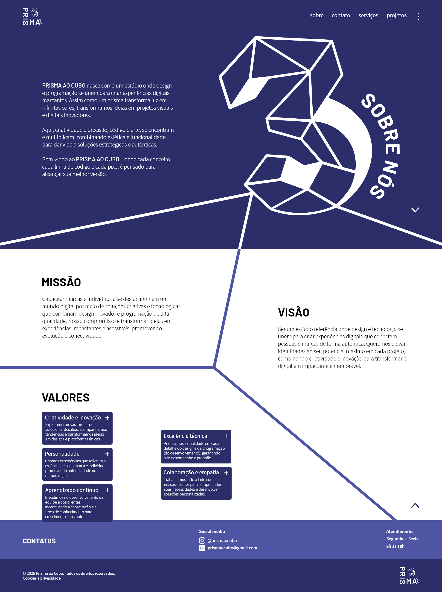
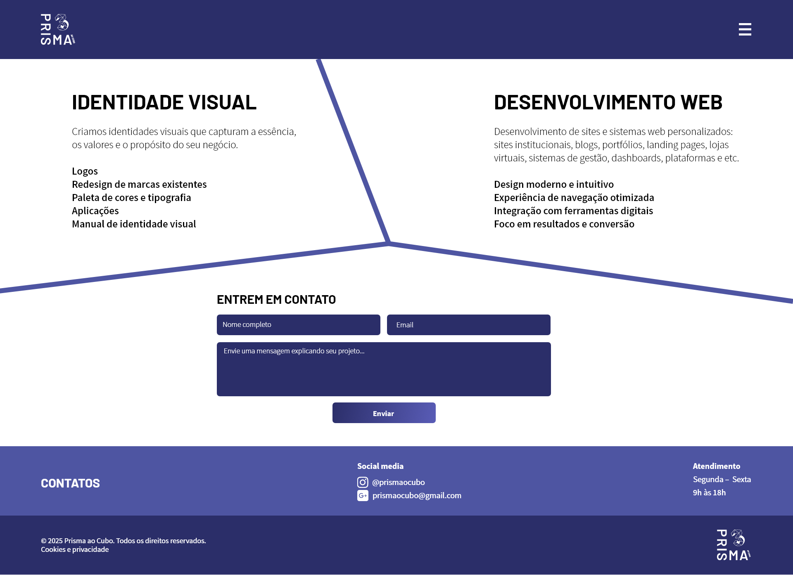
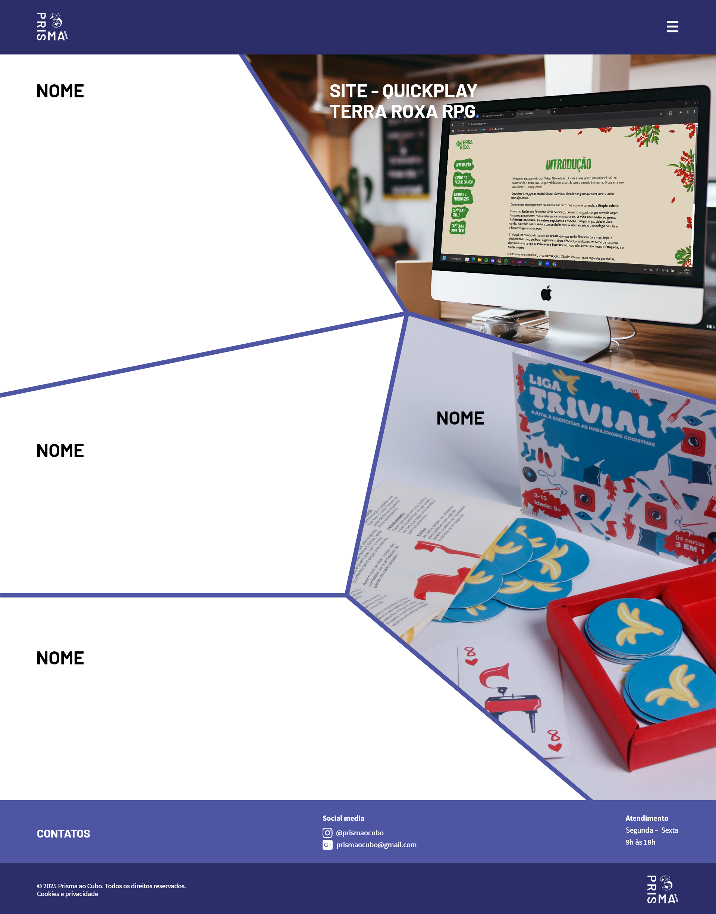
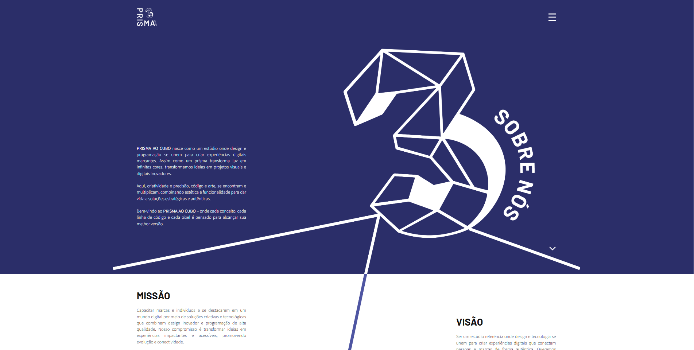
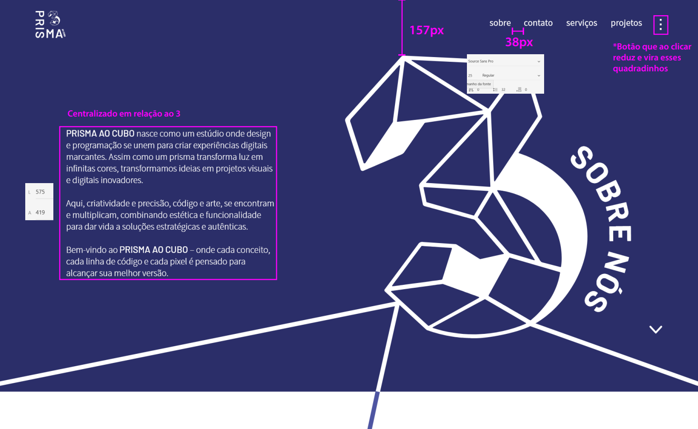

# Prisma ao Cubo

Implementação frontend do portfólio institucional do **Prisma ao Cubo**, desenvolvida a partir de uma identidade visual e prototipagem com requisitos específicos de posicionamento, escala e continuidade gráfica.

O projeto foi desenvolvido com **Vue.js 3 e Vite**, com atenção especial à reprodução fiel da composição definida no projeto visual.

> **Status:** desenvolvimento parcial.  
> A página principal **Sobre** e outras estruturas do site foram implementadas, porém a área completa de apresentação dos trabalhos/projetos não pode ser finalizada.

---

## Visão geral


*Fonte: @desing.bertonicarol*

*Fonte: @desing.bertonicarol*

*Fonte: @desing.bertonicarol*

O Prisma ao Cubo foi concebido como um estúdio voltado à integração entre design e desenvolvimento.

Minha responsabilidade neste projeto foi transformar a concepção visual em uma aplicação web funcional, preservando comportamentos específicos definidos durante a etapa de design.

A principal dificuldade não estava apenas em tornar a página responsiva, mas em preservar uma **composição gráfica rígida em um ambiente naturalmente fluido como o navegador**.

---

## O desafio de implementação

A página **Sobre** possuía requisitos que fugiam do comportamento responsivo convencional.

### Margens constantes

A identidade visual determinava que elementos importantes do cabeçalho permanecessem a aproximadamente **99 px das extremidades laterais**, conforme definido na prototipagem.

O requisito era preservar esse afastamento mesmo em situações nas quais o navegador alterasse sua escala.

Em uma implementação responsiva convencional, elementos posicionados proporcionalmente ao viewport tendem a se afastar das bordas conforme a área disponível aumenta.

Neste projeto, esse comportamento não era desejado.

A solução implementada considera a largura física disponível da tela e limita o crescimento do container, preservando os offsets laterais definidos pelo layout.

```css
.container {
  width: 100%;
  padding-left: 99px;
  padding-right: 99px;
}
```

Além disso, a largura máxima do container é calculada utilizando as dimensões da tela.

---

## Preservação da composição durante alterações de escala

Outro requisito importante dizia respeito ao comportamento da ilustração principal da página.

Ao reduzir o zoom do navegador, a imagem não deveria continuar crescendo indefinidamente para ocupar toda a nova área visual.

O objetivo era preservar sua proporção e posição dentro da composição original.

Para isso, a largura máxima da imagem é limitada a partir da largura da tela:

```javascript
const larguraTela = window.screen.width

bgImg.style.maxWidth = `${larguraTela}px`
```

A mesma estratégia é aplicada ao container relacionado à composição.

Essa decisão foi adotada especificamente para reproduzir o comportamento definido na concepção visual do projeto.

---

## Continuidade entre imagem e background

Um dos detalhes mais trabalhosos da página está praticamente invisível quando funciona corretamente.

A ilustração utilizada na seção Sobre contém regiões em:

```text
#2B2E69
branco
```

Essas regiões precisavam continuar visualmente pelo restante da página.

Ou seja, a transição entre:

```text
IMAGEM
   ↓
BACKGROUND HTML/CSS
```

não poderia ser perceptível.



A dificuldade é que a altura renderizada da imagem varia de acordo com o contexto de exibição.

Uma faixa de fundo com altura fixa poderia funcionar em uma resolução e apresentar desalinhamento em outra.

A implementação, portanto, mede a imagem renderizada e calcula dinamicamente o ponto em que ocorre a transição entre as áreas.

De forma simplificada:

```text
Imagem renderizada
        │
        ▼
medição da altura
        │
        ▼
cálculo do ponto de transição
        │
        ▼
variável CSS
--faixa-top-h
        │
        ▼
background alinhado à imagem
```

Um `ResizeObserver` acompanha alterações nas dimensões renderizadas e recalcula essa posição quando necessário.

O resultado buscado é fazer com que imagem e background sejam percebidos como uma única composição gráfica.

---

## Protótipo e implementação

O desenvolvimento foi realizado a partir de uma especificação visual contendo dimensões, espaçamentos, tipografia e cores.

Exemplo da prototipagem:


*Fonte: @desing.bertonicarol*

Entre as especificações estavam:

- margens laterais de referência;
- dimensões da navbar;
- posicionamento dos textos;
- comportamento dos elementos interativos;
- espaçamento entre seções;
- cores institucionais;
- tipografia;
- continuidade das linhas e elementos gráficos.

A implementação exigiu traduzir essas medidas estáticas para um ambiente web capaz de funcionar em diferentes tamanhos de tela.

---

## Tecnologias

```text
Vue.js 3
Vite
Vue Router
JavaScript
HTML
CSS
Bootstrap
Bootstrap Icons
```

A aplicação utiliza componentes Vue para separar elementos da interface, incluindo navegação e rodapé, além de views específicas para as páginas do site.

---

## Estrutura atual

A aplicação está organizada aproximadamente como:

```text
src/
├── assets/
├── components/
│   ├── Navbar.vue
│   └── Footer.vue
│
├── router/
├── views/
│   ├── Sobre.vue
│   └── Servicos.vue
│
├── App.vue
└── main.js
```

---

## Estado do projeto

Este projeto não chegou à versão final planejada.

A implementação avançou principalmente nas áreas estruturais e na página **Sobre**, que concentra a maior parte dos desafios de composição e responsividade.

A área destinada à apresentação completa dos trabalhos do Prisma ao Cubo não foi concluída.

O repositório é mantido como registro do desenvolvimento realizado e como demonstração da implementação de uma interface orientada por especificações visuais detalhadas.

---

## Créditos

### Desenvolvimento

Implementação frontend e adaptação da interface para web:

**Rafael Abe**

### Design

Concepção visual, identidade e prototipagem:

**Carolinne Bertoni**


A implementação apresentada neste repositório foi desenvolvida a partir da concepção visual elaborada pela designer acima. A autoria do design deve ser preservada em qualquer referência ao projeto.

---

## Direitos autorais e marca

**Prisma ao Cubo** e seus elementos de identidade visual são protegidos pelos direitos de propriedade intelectual aplicáveis.

A marca **Prisma ao Cubo** possui registro de titularidade de seu proprietário.

A disponibilização pública deste repositório tem finalidade de **portfólio e demonstração técnica** e não concede autorização para utilização da marca, logotipo, identidade visual, materiais gráficos ou demais ativos do Prisma ao Cubo.

Não é concedida licença para:

- utilizar a marca **Prisma ao Cubo** ou seus logotipos;
- reproduzir ou adaptar sua identidade visual;
- utilizar os materiais gráficos como identidade de terceiros;
- apresentar o projeto ou seus elementos como criação própria;
- utilizar os ativos da marca para fins comerciais sem autorização expressa.

Os créditos relativos à concepção visual também devem ser preservados.

**Todos os direitos sobre a marca e os ativos de identidade visual são reservados aos respectivos titulares.**

---

## Licenciamento

Este repositório é disponibilizado publicamente para fins de visualização, avaliação técnica e portfólio.

**Nenhuma licença de software ou de utilização dos ativos da marca é concedida por este repositório, salvo indicação expressa em contrário.**
